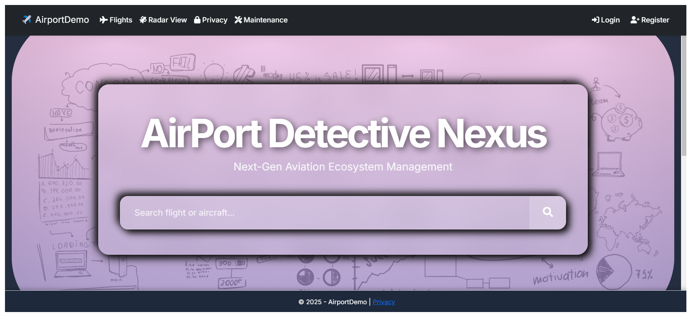
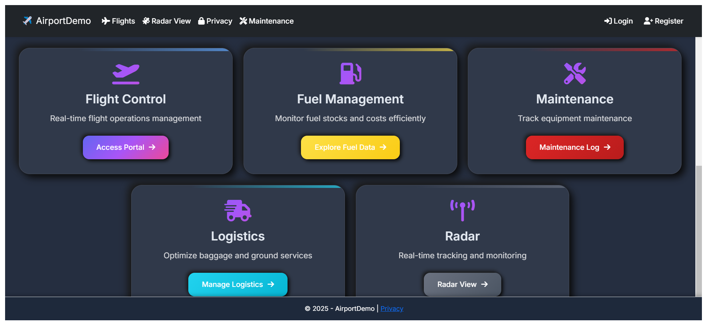
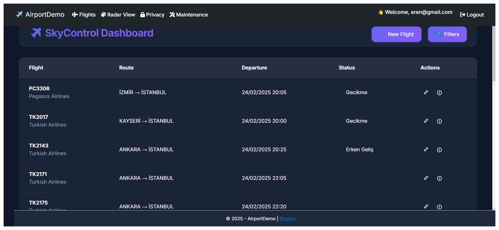
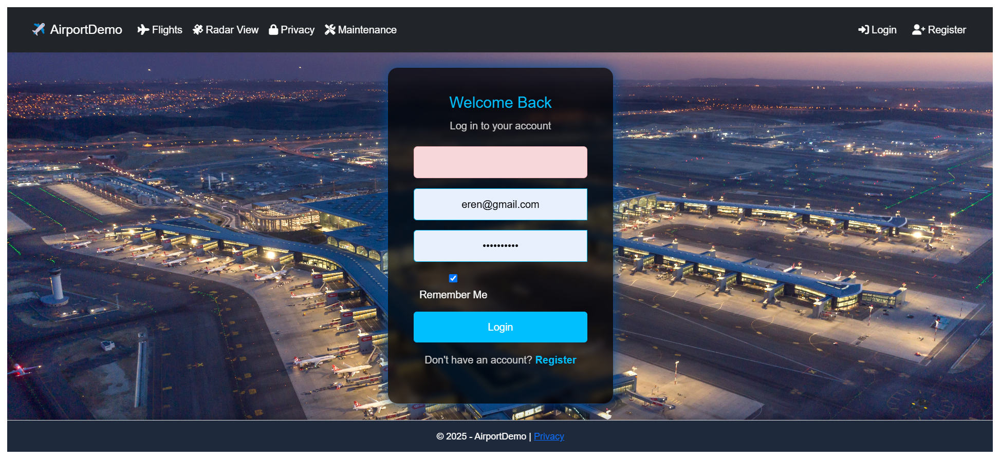
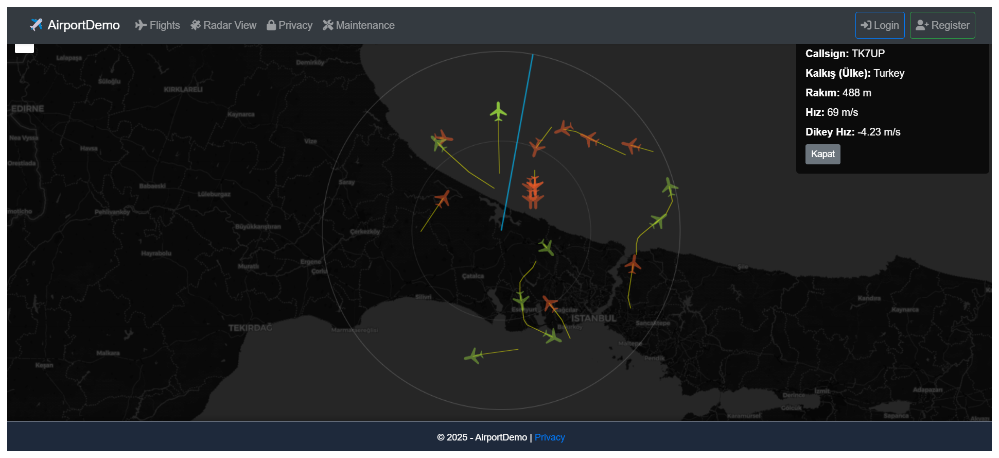
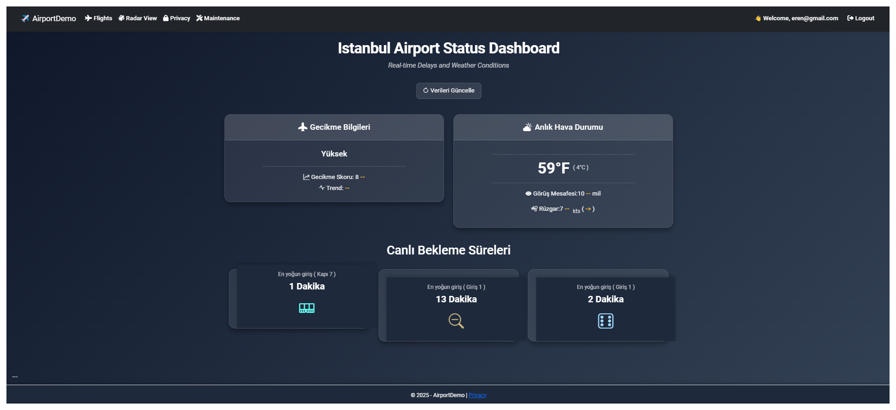

# AirportDemo


[](LICENSE)


## Table of Contents
- [Overview](#overview)
- [Project Background](#project-background)
- [Technologies Used](#technologies-used)
- [Screenshots](#screenshots)
- [Getting Started](#getting-started)
  - [Prerequisites](#prerequisites)
  - [Installation](#installation)
  - [Running the Application](#running-the-application)
- [Module Descriptions](#module-descriptions)
- [Usage](#usage)
- [Contributing](#contributing)
- [License](#license)
- [Contact](#contact)
  
## Project Background

I developed this project during my internship at **Istanbul Airport**, one of the largest airports in **Europe**. It was built as a system to facilitate the tracking of aircraft around **Istanbul Airport**, display **estimated delay times**, and serve as an **information platform** for both passengers and staff. In future developments, the project aims to predict the **runway positions** of aircraft that turn off their radars after landing by analyzing their positions and statuses, thereby **informing the ground crew accordingly**.

---
---

## Overview

**AirportDemo** (codename **Airport Detective Nexus**) is a next-generation aviation ecosystem management web application built with **ASP.NET Core 9.0**. This project demonstrates various features relevant to airport operations, including:

- **Real-time Flight Tracking**
  On this page, we can track in real time the flights departing from and arriving at Istanbul Airport, one of the largest airports in Europe. Departing flights are marked in green, while arriving flights are marked in orange.
- **Fuel Management**
  TODO: This module manages fuel consumption, scheduling, and tracking to optimize efficiency and reduce costs. 
- **Logistics**
  TODO: This module handles various logistical operations, such as cargo management, passenger boarding, and ground services, ensuring smooth airport operations.
- **Maintenance Modules**
  On this page, the flight delay rate score of Istanbul Airport is displayed along with information about local weather conditions and wind speeds. Additionally, it shows in real time how long passengers need to wait at entrances, staircases, and passport control checkpoints to board their flight.
- **Flight Control**
  In this section, we can view the delay statuses, routes, and take-off/landing times of flights departing from and arriving at Istanbul Airport. It also provides real-time search functionality across flights.

---

## Technologies Used

- **ASP.NET Core 9.0** – Primary framework for the application.
- **C#** – Main programming language.
- **Entity Framework Core (EF Core)** – ORM for database interactions.
- **SQLite** – Lightweight, file-based database engine.
- **Razor Pages/Views** – For creating dynamic web content.
- **Newtonsoft.Json** – For JSON serialization and deserialization.

---

## Screenshots

Below are some screenshots of the application in action. 

### 1. Home Page
  


### 2. **Flight Control**


### 3. Login Page


### 4. **Real-time Flight RADAR Tracking**


### 5. **Maintenance Modules**


---

## Getting Started

### Prerequisites

- [.NET SDK 9.0](https://dotnet.microsoft.com/download/dotnet/9.0) must be installed on your machine.

### Installation

1. **Clone the repository:**
   ```bash
   git clone [repository-url]
